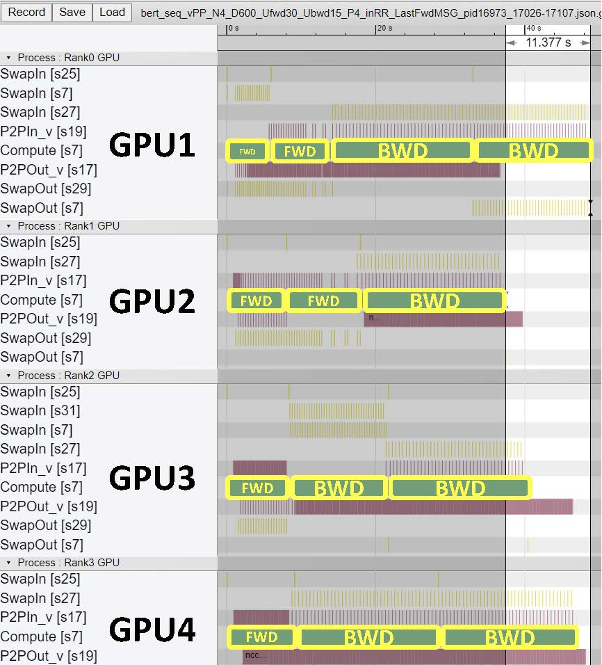

# Harmony Viewer

This directory contains code to visualize the Harmony Runtime in `chrome-trace` (chrome://tracing/) via [nvprof](https://docs.nvidia.com/cuda/profiler-users-guide/index.html#nvprof-overview) via `nvprof2json.py`, which convert nvvp file (SQLite3 databases) to Google Trace Event Format. The `nvprof2json.py` is developed on top of the [ezyang's nvprof2json](https://github.com/ezyang/nvprof2json).

## Example of Visualization

## Example Scripts

An example script (`run_viewer.sh`) is provided.